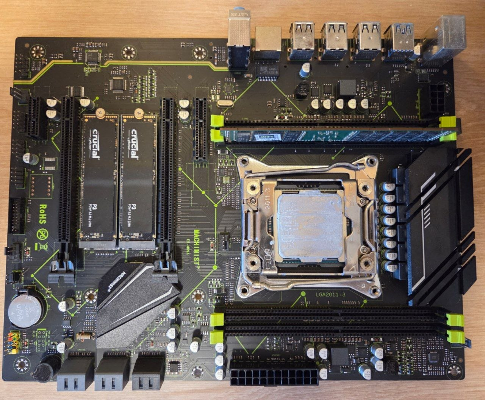
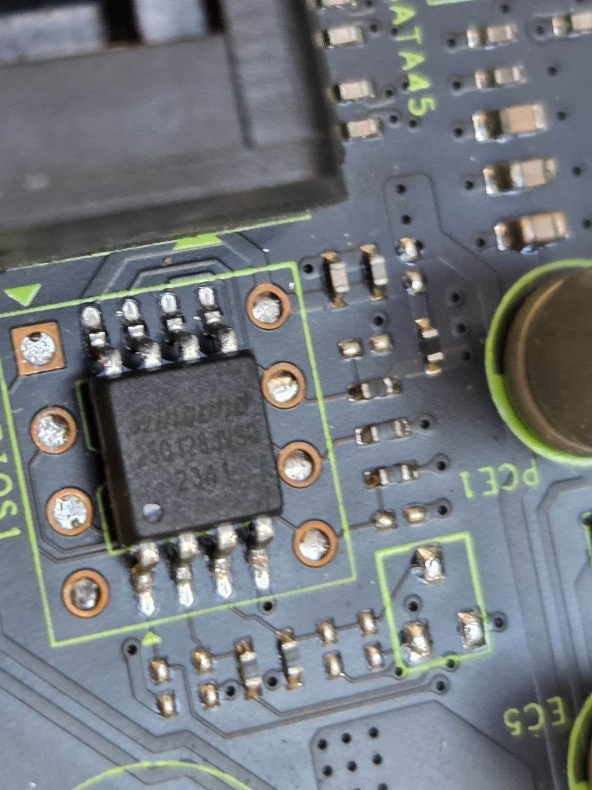
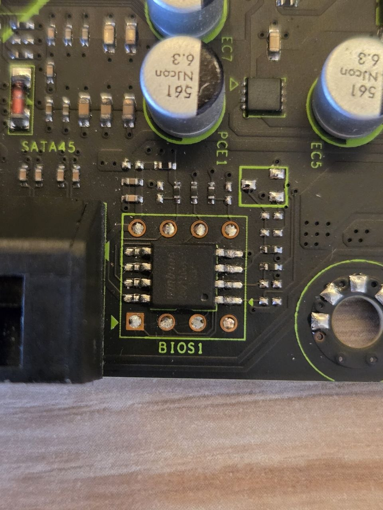
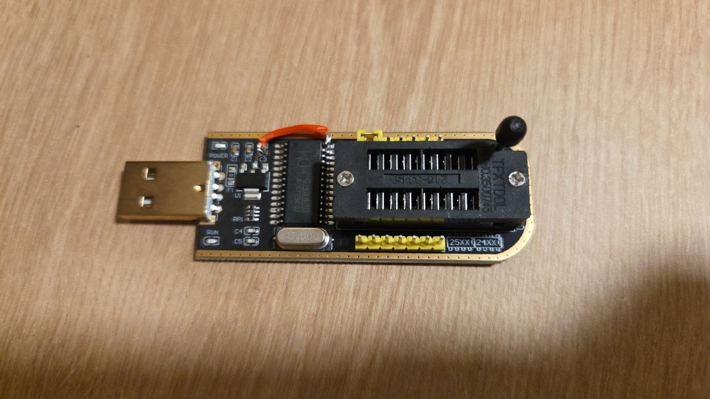
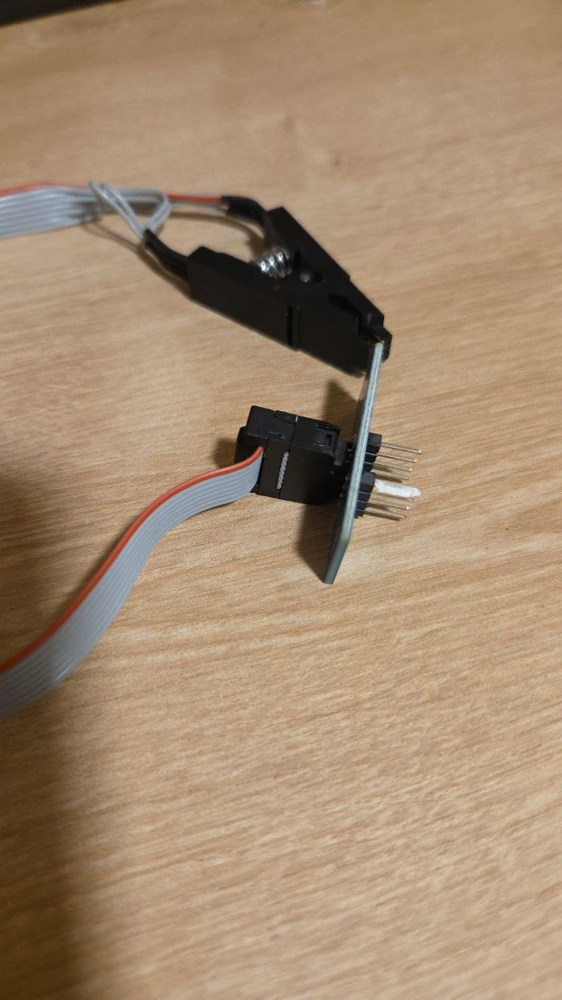

# Machinist E5-MR9A (X99-MR9A) LGA2011-3 Motherboard

[](LICENSE)

Documentation, BIOS resources, and hardware notes for the **Machinist E5-MR9A** (also known as **X99-MR9A**), an LGA2011-3 motherboard based on the Intel B85 chipset.



---

## Specifications

| Component | Details |
|---|---|
| **Model** | Machinist E5-MR9A (X99-MR9A) |
| **Form Factor** | ATX (216 mm x 283 mm) |
| **Socket** | LGA2011-3 |
| **Chipset** | Intel B85 |
| **CPU Support** | Intel Xeon E5 v3/v4 (Haswell-EP / Broadwell-EP) |
| **Memory** | 4x DDR4 DIMM slots, four memory channels, supports both server (RDIMM) and desktop (UDIMM) memory, up to 4x 32 GB |
| **Storage** | 2x M.2 slots (NVMe), 4x SATA 2.0, 2x SATA 3.0 |
| **PCIe** | 2x PCIe x16, 1x PCIe x4, 1x PCIe x1 |
| **BIOS** | Winbond 25Q128JVSQ (128 Mbit / 16 MB), soldered on PCB |
| **Rear I/O** | 1x Gigabit Ethernet, 1x PS/2, 6x USB 2.0, 2x USB 3.0 |
| **Power** | 24-pin ATX, 8-pin CPU EPS |
| **Battery** | CR2032 |
| **PCB** | Black with lime green accents |

### M.2 Slot Compatibility

| Slot | NVMe | SATA M.2 |
|---|---|---|
| **M.2 #1** | Yes | Yes |
| **M.2 #2** | Yes | No |

## Tested Hardware

| Component | Model | Details |
|---|---|---|
| **CPU** | Intel Xeon E5-2650v4 | Broadwell-EP, 12 cores / 24 threads, 2.2 GHz base / 2.9 GHz turbo, 30 MB L3, 105 W TDP |
| **Memory** | Smart PC4-2133P-RA1 | 16 GB, 2Rx4, DDR4-2133 Registered ECC (RDIMM) |
| **Storage** | 2x Crucial P3 | NVMe M.2 SSDs (both slots functional) |

The E5-2650v4 is a Broadwell-EP processor. The board also supports Haswell-EP (E5 v3) CPUs.

## BIOS Chip

The motherboard uses a **Winbond 25Q128JVSQ** SPI flash chip for the BIOS, soldered on the PCB and marked as **BIOS1**. It is located just above the SATA connectors, on the right side of the board.

- **Capacity:** 128 Mbit (16 MB)
- **Interface:** SPI
- **Voltage:** 3.3V
- **Package:** SOIC-8




The dump in this repository was performed with the chip still on the board using a SOIC8 test clip.

## Stock BIOS Dump

The original factory BIOS was dumped using a **CH341A USB programmer** with a **SOIC8 test clip**. The required driver for the CH341A on Windows is included in this repository: [`drivers/CH341PAR_driver.zip`](drivers/CH341PAR_driver.zip). The dump was performed using **ASProgrammer**, which is also included: [`drivers/AsProgrammer_2.1.2.zip`](drivers/AsProgrammer_2.1.2.zip) (available from the [UsbAsp-flash project](https://github.com/nofeletru/UsbAsp-flash)).




### CH341A 3.3V Mod

The Winbond 25Q128JVSQ operates at 3.3V, but the CH341A outputs 5V by default on its ZIF socket pins. A hardware modification was required to avoid damaging the chip. Additionally, pin 8 (VCC) on the ZIF socket was blocked because the motherboard's standby power rail supplies VCC to the chip during the dump (the programmer should not drive VCC).

The modification was done as follows:

1. **Pin 28** of the CH341A IC was lifted from its PCB pad using a flush cutter
2. A **jumper** was soldered from the lifted pin 28 to **capacitor C4**
3. A **jumper** was soldered from capacitor C4 to the **center pin (3.3V output)** of the voltage regulator
4. **Pin 8 (VCC)** on the ZIF socket was blocked with insulating tape

This routes the 3.3V supply from the voltage regulator through C4 to pin 28, which controls the output voltage of the ZIF socket pins.

### Dumping Procedure

> **Critical observation:** The motherboard **must be connected to the PSU in standby mode** (PSU switched on, 24-pin and 8-pin CPU EPS connected, but the board **not powered on**). The standby power rail (VSB) supplies VCC to the BIOS chip. Without standby power, the CH341A reads only `0xFF` bytes.
>
> **Note:** When the clip was connected to the BIOS chip with the PSU in standby, the MR9A's buzzer emitted a **continuous beep** for the entire duration the clip was attached. This did **not** occur when the PSU was disconnected. The cause of this behavior is unknown, but it did not affect the read operation (the dump completed successfully and the data was verified as correct).

The dump was performed as follows:

- The PSU was connected to the 24-pin ATX and 8-pin CPU EPS connectors and switched on (the board entered standby mode). The power button was **not** pressed.
- The SOIC8 clip was attached to the Winbond 25Q128JVSQ chip, with pin 1 aligned to the dot on the chip (red wire on the clip).
- The clip's ribbon cable was connected to the CH341A programmer, and the programmer was plugged into a USB port.
- The chip was read using **ASProgrammer**, selecting Winbond 25Q128JVSQ. The read took approximately 2 to 3 minutes.
- To verify the dump was reliable, the chip was read a **second time using NeoProgrammer**. Both dumps were compared and confirmed **byte-identical**.

The resulting dump is **16,777,216 bytes** (16 MB) and identifies as **Intel serial flash for PCH ROM**.

**File:** [`stock-bios/Machinist-E5-MR9A-stock-dump.bin`](stock-bios/Machinist-E5-MR9A-stock-dump.bin)

> **Disclaimer:** This dump was taken from a specific board and may not work on other units. Chinese motherboards often share the same model name but can have different components, revisions, and firmware. Use at your own risk. The author is not responsible for any damage or issues resulting from the use of this dump. Always back up your original BIOS before making any modifications.

## Custom BIOS (Mi899)

After dumping the stock BIOS, a custom BIOS was flashed using the [Mi899](https://github.com/miyconst/Mi899) toolset.

- **File:** `huananzhi-x99-8m-f.tp.s3tt.7050.rom`
- **Size:** 16,777,216 bytes (16 MB)
- **Base:** Huananzhi X99-8M-F stock BIOS (the board identifies as this model after flashing)

**Modifications included in this BIOS:**

| Feature | Description |
|---|---|
| **Undervolt** | -70 mV / -50 mV CPU voltage offset |
| **Turbo Boost** | Unlocked (all-core turbo enabled) |
| **Resizable BAR (ReBAR)** | Enabled (allows the CPU to access the full GPU VRAM) |
| **RAM Timings** | Unlocked (full memory timing configuration available) |

> **Note:** This custom BIOS appears to be derived from the Huananzhi X99-8M-F firmware, as that is the model name displayed in the BIOS setup menu after flashing.

**File:** [`custom-bios/huananzhi-x99-8m-f.tp.s3tt.7050.rom`](custom-bios/huananzhi-x99-8m-f.tp.s3tt.7050.rom)

### Flashing

The custom BIOS was flashed using **FPT-9.1.10** (Intel Flash Programming Tool) from a **FreeDOS** bootable USB drive.

- The system was booted in **Legacy/BIOS mode** (FreeDOS does not boot in UEFI mode).
- The following files were placed on the USB drive: `FPT.exe` and the custom ROM file.
- After booting into FreeDOS, the flash was performed with:
  ```batch
  FPT.exe -f huananzhi-x99-8m-f.tp.s3tt.7050.rom
  ```
- The system was not powered off during the flashing process.
- After completion, the system was rebooted and BIOS settings were configured.

### Results

The custom BIOS flash was **successful**. The system is **stable** with the following improvements:

- Lower CPU voltages under load, reducing power consumption and heat output
- Improved multi-core performance from unlocked Turbo Boost
- Full control over memory timings for RAM tuning
- **Idle power consumption:** 39.8 W with Proxmox running (no VMs active, no GPU connected)

## Repository Contents

```
machinist-e5-mr9a-docs/
|-- README.md                          # This documentation
|-- LICENSE                            # GNU General Public License v3.0
|-- assets/
|   |-- board-overview.jpg             # Motherboard overview photo
|   |-- bios-chip-closeup.jpg          # Winbond 25Q128JVSQ close-up
|   |-- bios1-socket.jpg               # BIOS1 location on board
|   |-- ch341a-programmer.jpg          # CH341A programmer
|   |-- soic8-clip.jpg                 # SOIC8 test clip connection
|-- drivers/
|   |-- CH341PAR_driver.zip            # CH341A Windows driver
|   |-- AsProgrammer_2.1.2.zip         # ASProgrammer software
|-- stock-bios/
|   |-- Machinist-E5-MR9A-stock-dump.bin       # Original factory BIOS dump (16 MB)
|-- custom-bios/
|   |-- huananzhi-x99-8m-f.tp.s3tt.7050.rom    # Custom Mi899 BIOS (16 MB)
```

## License

This repository is licensed under the **GNU General Public License v3.0**. See the [LICENSE](LICENSE) file for details.

The included stock BIOS dump is provided for reference and recovery purposes. The custom Mi899 BIOS is the work of its respective authors and is subject to its own licensing terms.
